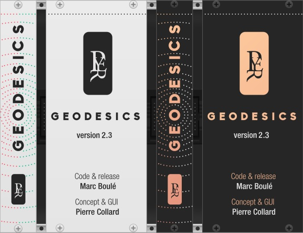
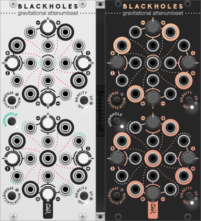
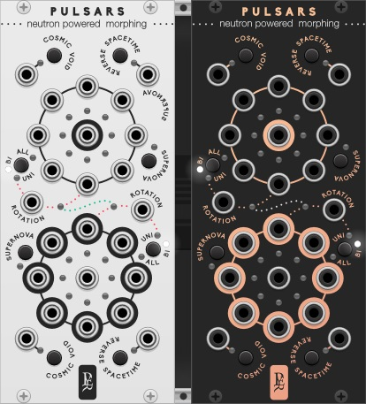
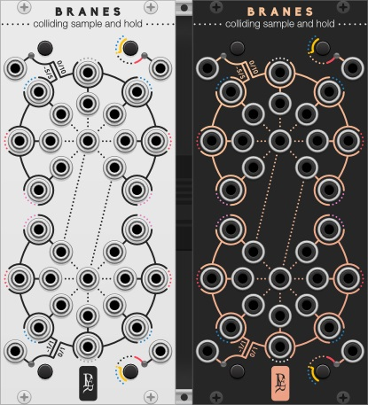
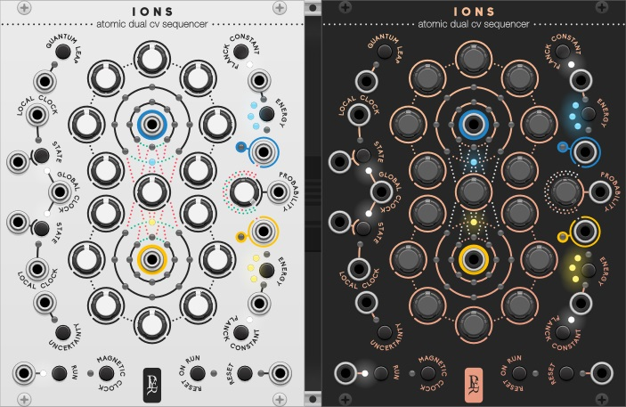
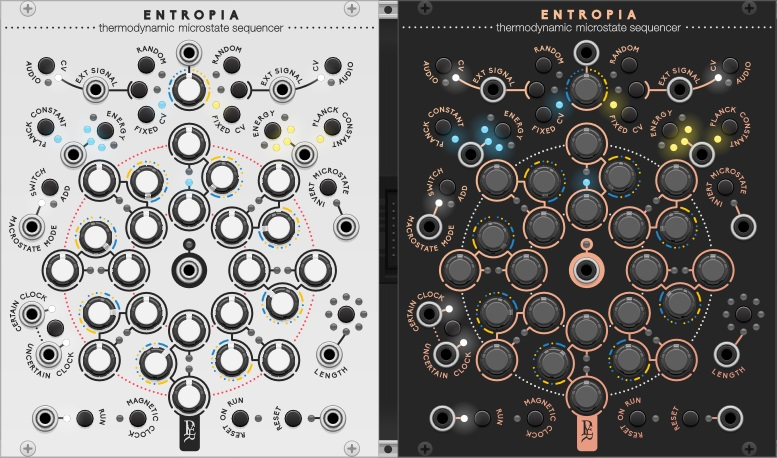
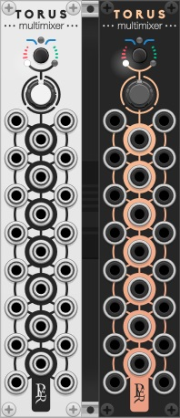
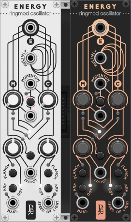
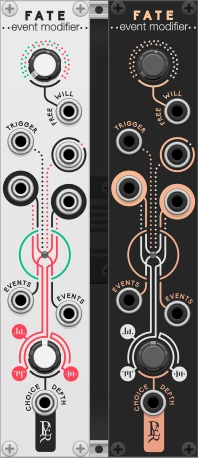

This page shows a very brief overview of the modules. For more information, including videos of the modules in use, please see the [Geodesics Website](https://www.pyer.be/geodesics.html). The modules are available in the [plugin library](https://vcvrack.com/plugins.html) of [VCV Rack](https://vcvrack.com). 

* [Complete user manual](doc/geodesics2.0-complete_user_manual.pdf) (version 2.2.0)

[//]: # (!!!!!UPDATE VERSION NUMBER IN PLUGIN.JSON ALSO!!!!!   120% Zoom for jpgs)

## License

Based on code from the Fundamental plugins by Andrew Belt and graphics from the Component Library by Wes Milholen. See [LICENSE.md](LICENSE.md) for all licenses.

# Modules

Each module comes with two panel options, namely White Light and Dark Matter.

* [Black Holes](#blackholes): Gravitational voltage controled amplifiers.

* [Pulsars](#pulsars): Neutron powered morphing.

* [Branes](#branes): Colliding sample and hold.

* [Ions](#ions): Atomic duophonic voltage sequencer.

* [Entropia](#entropia): Thermodynamic evolving sequencer.

* [Torus](#torus): Bi-dimensional multimixer.

* [Energy](#energy): Relativistic ring modulation oscillator.

* [Fate](#fate): Non-deterministic event modifier.

For sequencer modules, more detailed information on how to set up clocks, resets and run states can be found in the Impromptu Modular [manual](https://github.com/MarcBoule/ImpromptuModular#on-resets-clocks-and-run-states-).

## Black Holes

A black whole attracts everything that gravitates around to its center, even audio and CV signals... [BLACK HOLES](doc/geodesics2.0-black_holes.pdf) is 8 vcas in two groups of 4, it’s also two mixers with 4 channels each. 
For a video introduction to this module, please see Omri Cohen's [Black Holes tutorial](https://www.youtube.com/watch?v=dUIPvfnc4dI).

## Pulsars

A pulsar is a star turning on itself and emitting very high and precise frequencies on its spinning axis. [PULSARS](doc/geodesics2.0-pulsars.pdf) is a rotating 8 to 1 and 1 to 8 selector with crossfade in between each signal. It can be used to create cross fade mix of audio, complex wave tables with CV, standard sequential switch or extreme effects when turning at audio range speed.
For a video introduction to this module, please see Omri Cohen's [Pulsars tutorial](https://www.youtube.com/watch?v=yb3Z1LGSOjQ).

## Branes

Branes are multidimensional object involved in the ekpyrotic universe theory that describes two parallel universes colliding to create our world... [BRANES](doc/geodesics2.0-branes.pdf) is 2 groups of seven S&H driven by the same trigger source. Two of them receive added trigger clocks for polyrhythmic effects. 
For a video introduction to this module, please see Omri Cohen's [Branes tutorial](https://www.youtube.com/watch?v=vncNcfHWH5Q).

## Ions

An Ionic bond describes two atoms that exchanges electrons. [IONS](doc/geodesics2.0-ions.pdf) is a two voices sequencer. While each voice has its own sequence, they can exchange their sequences as easily as an electron can jump from one atom to another.
For a video introduction to this module, please see Omri Cohen's [Ions tutorial](https://www.youtube.com/watch?v=VEKbma--PMo).

## Entropia

Entropy is a measure of disorder in a system: many microstates of atoms that create a rich and complex macrostate. [ENTROPIA](doc/geodesics2.0-entropia.pdf) is an 8-step sequencer with two values per step, and a probability to play one of the two values. Both values can be a defined sequence of voltages, a range controlled random source, or an external source.
For a video introduction to this module, please see Omri Cohen's [Entropia tutorial](https://www.youtube.com/watch?v=UGzF5vmssGs).

## Torus

A torus is a 2-dimensional surface closed on itself. Some believe it could be the shape of the universe. [TORUS](doc/geodesics2.0-torus.pdf) mixes and attenuates the incoming signal in different ways depending on the distance between the input and output jack. Torus is a small module that can be many things: up to 6 4-channel adjustable mixers, 3 multipliers, 7 unity mixes with 4 channels, 7 attenuators... and all at the same time.
For a video introduction to this module, please see Omri Cohen's [Torus tutorial](https://www.youtube.com/watch?v=oXTPhMoe348).

## Energy

How would the most meaningful equation of modern physics sound? If a small amount of mass can be turned into an incredibly big amount of energy, two simple sine waves can create unexpected tones with rich harmonic content. [ENERGY](doc/geodesics2.0-energy.pdf) is a digital oscillator/synth voice that focuses on ring modulation synthesis. Two sines are multiplied according Einstein/Poincaré’s famous equation. It is capable of meditative drones, organ tones, extreme noises, and low modulations.
For a video introduction to this module, please see Omri Cohen's [Energy tutorial](https://www.youtube.com/watch?v=pNjUCVg9O_Y).

## Fate

Is there such thing as free will? While scientists and philosophers are debating the question, Geodesics proposes [FATE](doc/geodesics2.0-fate.pdf), a dual event modifier that will bring any sequencer to life by making its own musical choices. FATE alters any signal by adding a specific amount of randomness at some chosen points, or by switching in with another signal in a probabilistic way. Without any incoming signal, FATE acts as a dual probabilistic random generator and a Bernoulli gate.
For a video introduction to a previous version of this module, please see Omri Cohen's [Fate tutorial](https://www.youtube.com/watch?v=6HRe-CnAO2E).
